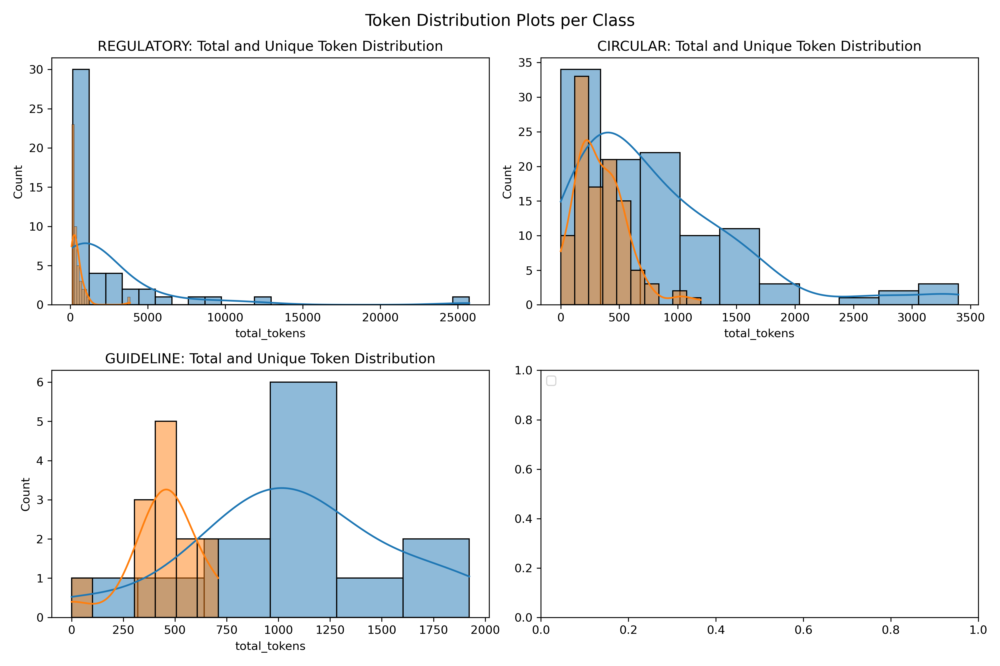
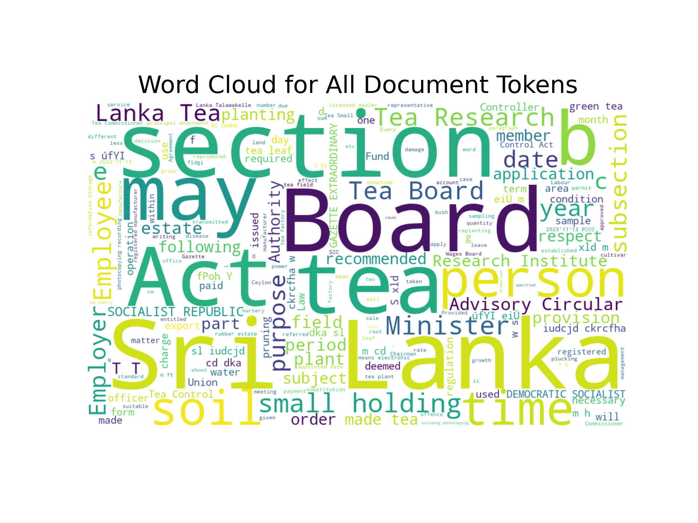
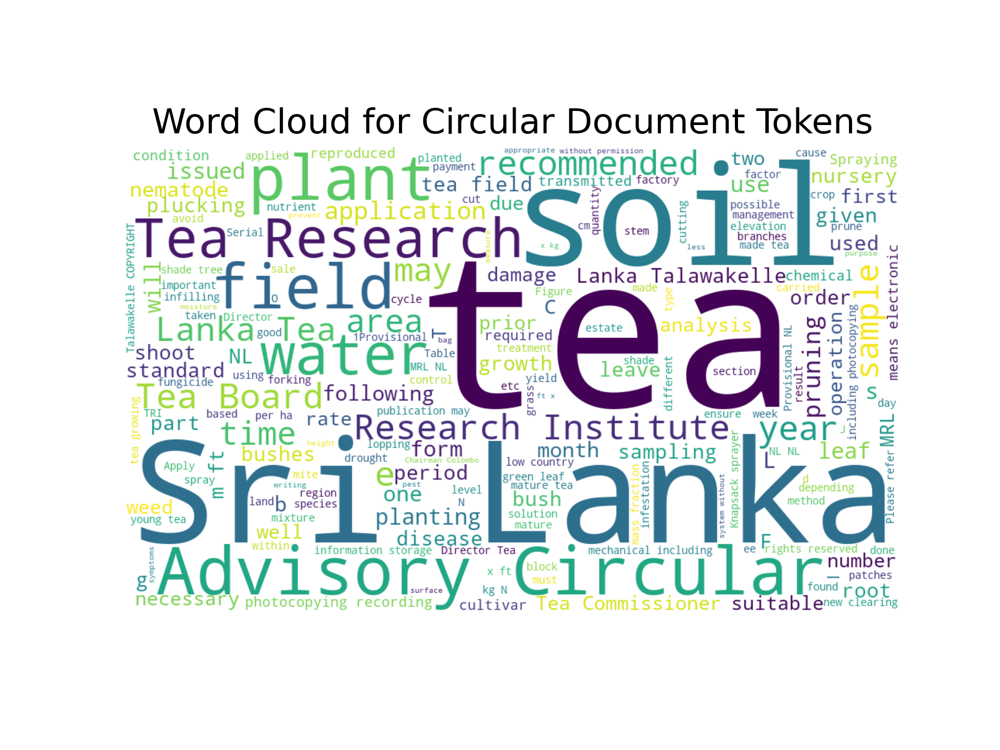
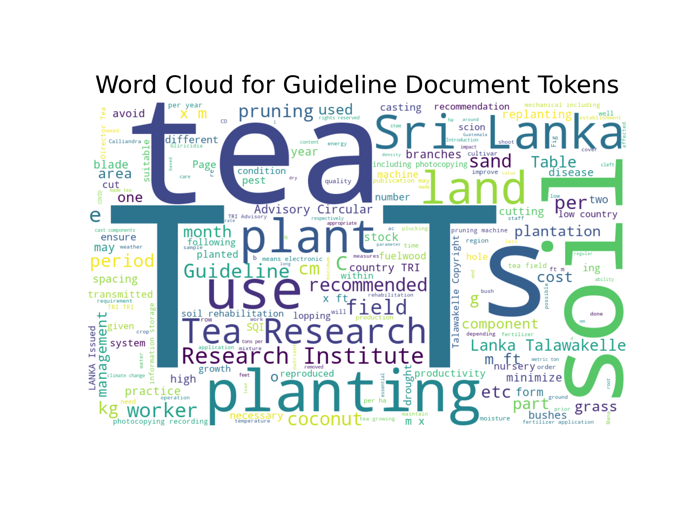

# Tokenization Statistical Analysis

## 1. Introduction
This analysis focuses on exploring tokenization and semantic chunking for a regulatory knowledge base. The goal is to understand token distributions, document statistics, and chunk-level properties across the dataset. 

The dataset includes fields such as:
- **`class`**: Category of the document (e.g., regulatory, circular, guideline).
- **`markdown_content`**: Full markdown text content for each document.
- **`tokens`**: Tokenized representation of the markdown text.
- **Chunk Statistics**: Metrics related to semantic chunking.

---

## 2. Dataset Overview
**Key Statistics:**
- The dataset comprises multiple columns, including:
  - `class`
  - `quality`
  - `tokens`
  - `chunk_count`
- Summary statistics include the shape (number of rows and columns) and basic feature descriptions.

---

## 3. Class Distribution
This section examines the distribution of documents across different classes, origins, and quality indicators.

**Plot: Count of Each Class in Different Columns**  

---

## 4. Document Statistics
Analysis of document-level statistics such as document counts, token counts, and unique token counts across different classes.

**Plot: Document Statistics for Each Class**  

---

## 5. Token Statistics

### Tokenization Overview
Analyzing the total and unique token counts for each document. This helps to understand the textual variability within the dataset.

**Plot: Token Distribution**  

### Class-wise Token Statistics
Examining token distributions across individual document classes to highlight intra-class variability.

**Plot: Token Distribution per Class**  

---

## 6. Text Length Insights
Exploration of the length of documents (in tokens) across different classes using boxplots. This helps to identify variations in document sizes.

**Plot: Token Count Boxplot per Class**  

---

## 7. Chunk Analysis

### Chunk Counts
Investigation of the number of semantic chunks created per document.

**Plot: Chunks per Document**  

### Chunk Sizes
Exploration of average and maximum chunk sizes in terms of token counts.

- **Plot: Average Chunk Tokens**  
  

- **Plot: Maximum Chunk Tokens**  
  

---

## 8. Word Clouds

### All Documents
Visualization of frequently occurring terms across the entire dataset.

**Plot: Word Cloud for All Document Tokens**  

### Class-Specific Word Clouds
Highlighting the most frequent terms for specific document classes:
- **Regulatory Documents**  
  

- **Circular Documents**  
  

- **Guideline Documents**  
  